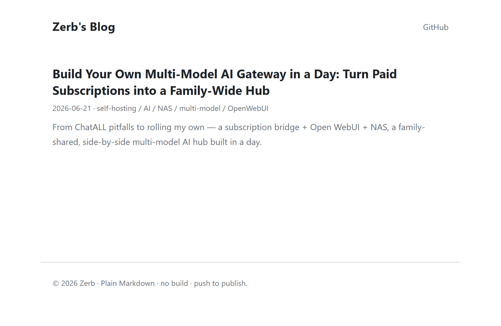

<div align="center">

# 📝 zero-build-blog

**English** · [中文](README.zh-CN.md)

**A zero-build, push-to-publish personal blog — write Markdown, `git push`, and a clean GitHub Pages site renders itself. No generator, no CMS, no pipeline.**

[](https://zerblion.github.io/zero-build-blog/)
-2ea44f)


<br/>

[](https://zerblion.github.io/zero-build-blog/)

</div>

---

## 🤔 Why this exists

Every "simple" blog wants you to install a static-site generator, learn its templating, run a build, and babysit a deploy. I just wanted to **write a Markdown file and have it show up online.**

`zero-build-blog` is the smallest thing that does that:

- **No build step.** No Hugo / Jekyll / Astro, no `node_modules`, no CI. The repo *is* the website.
- **`git push` is the deploy.** Add a folder, push — GitHub Pages serves it and a ~400-line vanilla-JS engine renders it.
- **You own everything.** Plain Markdown in a Git repo. No database, no lock-in, portable forever.

## ✨ What you get

- 🗂 **Auto index** — drop a post folder and it appears on the home page (newest first). No list to hand-maintain.
- 🔗 **Auto prev/next** — inter-post navigation is generated from the post list.
- 💬 **Comments** — GitHub Discussions via [Giscus](https://giscus.app), no third-party tracker.
- 🌓 **Dark mode** — follows the system theme.
- 🎨 **Syntax highlighting** — highlight.js, light/dark aware.
- 🖼 **Images & relative links** — just write `images/x.png`; the engine resolves them per post.
- 🪶 **Tiny** — one `index.html`, ~400 lines of JS, one stylesheet. Libraries load from a CDN; the shell caches like an app.

## 🧭 How it works

```
   write Markdown              git push                 GitHub Pages
  posts/<date>-slug/   ──────────────────►   main   ──────────────────►   index.html + assets/
        index.md                                                                 │
                                                                                 │  in the browser
            ┌─────────────────────────────────────────────────────────────────────┘
            ▼
   GitHub Contents API  ──►  list posts   (frontmatter: title / date / summary / tags)
   posts/<dir>/index.md ──►  marked + DOMPurify + highlight.js  ──►  rendered article
                                                                 └─►  Giscus comments
```

The home page lists posts by reading the repo's `posts/` directory through the **public GitHub API**; each article's Markdown is fetched and rendered client-side. That's the whole trick — **the data source is the Git repo itself.**

## 🚀 Use it yourself

```bash
# 1) Fork, then clone
git clone https://github.com/<you>/<your-blog>.git
cd <your-blog>

# 2) Point the engine at your repo
#    edit assets/app.js → CONFIG.repo  (and CONFIG.giscus.repo)

# 3) Enable GitHub Pages:  Settings ▸ Pages ▸ Branch: main / root
#    the repo must be PUBLIC — the engine lists posts via the anonymous GitHub API
```

> **Comments (optional):** install the [giscus app](https://github.com/apps/giscus) on the repo, turn on Discussions, then fill `repoId` / `categoryId` in `assets/app.js`.

## ✍️ Writing a post

```
posts/
└─ 2026-06-21-multi-model-ai-gateway/
   ├─ index.md      # frontmatter + body
   └─ images/       # referenced as images/arch.png
```

```markdown
---
title: 一天搭建自己的多模型 AI 网关
date: 2026-06-21
summary: 一句话简介，显示在首页卡片上。
tags: [自托管, AI, NAS]
---

正文从这里开始……
```

Push it. The post shows up on the home page automatically — no index to update, no build to run.

## 🗺 Roadmap

- [ ] RSS / Atom feed
- [ ] Tag pages
- [ ] Per-post cover images on the home page
- [ ] Reliable mainland-China mirror (Cloudflare Pages / self-host)

## 📜 License

[MIT](LICENSE) for the engine (`index.html`, `assets/`). The writing under `posts/` is © its author — reuse the machinery, not the words.

---

<div align="center">

A homemade, zero-build blog by [**@ZerbLion**](https://github.com/ZerbLion). <br/>
If it saved you from spinning up yet another static-site generator, a ⭐ means a lot.

</div>
