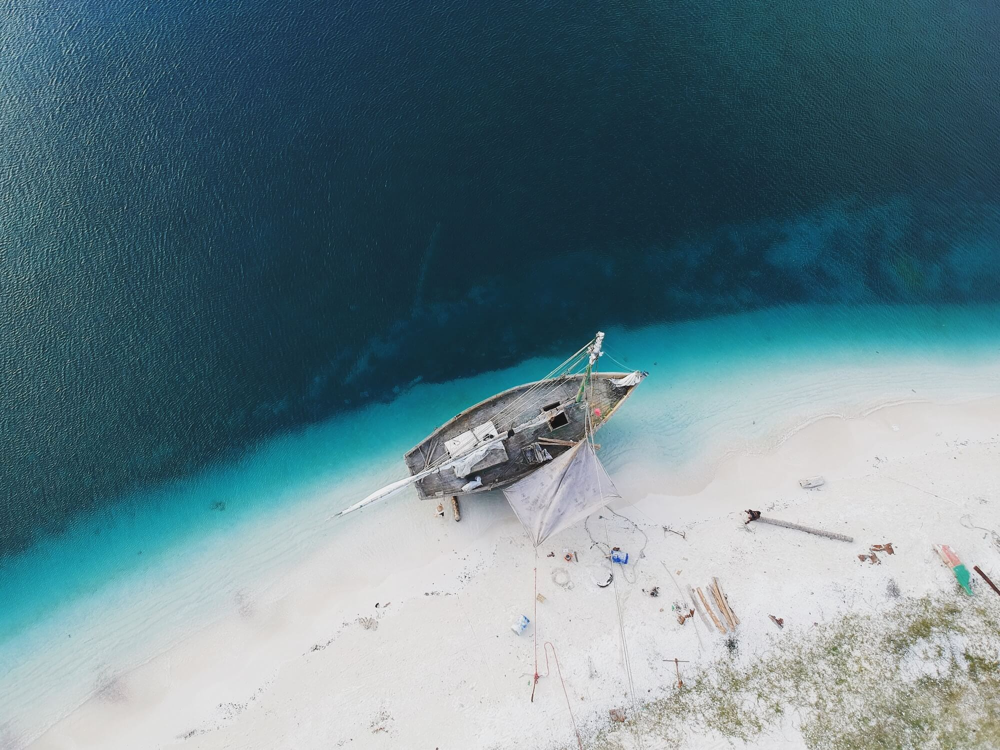
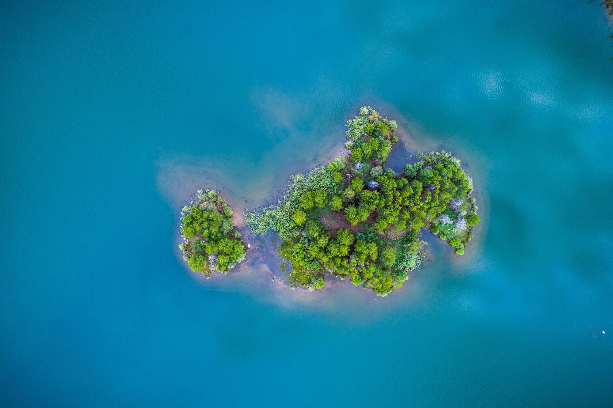
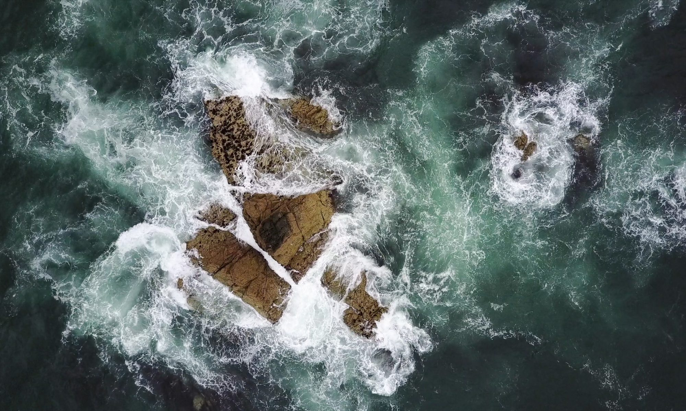

# Gentle Gale

*Soundtrack: ["This Is Not Where We Are Supposed To Be"](https://music.163.com/#/song?id=1309897) — NetEase Cloud Music*

Midday. Wandering through the Fourteen-Inch Resort, the post-rock track "This Is Not Where We Are Supposed To Be" echoing in my ears.

So let me sink into this quiet afternoon:

Even amid pooling sewage, flying trash, and air thick with malice.

A rush of feelings in an instant — yet all I want is to walk this road to its end.

If one day — yesterday, or some future day — if my fortune isn't even enough to fall to beggary, I hope to lie spread-eagled on an empty desert or shore, savoring a moment of fierce sun, draped in a gentle gale, meeting a fleeting death, chasing an everlasting one.

And if I still could, I'd lie in a rocking chair on the rooftop — sun blazing, wind blowing, gazing on — until the sun sinks west, until the sky fills with stars, until I no longer know why.

Finite warmth, finite limits.
