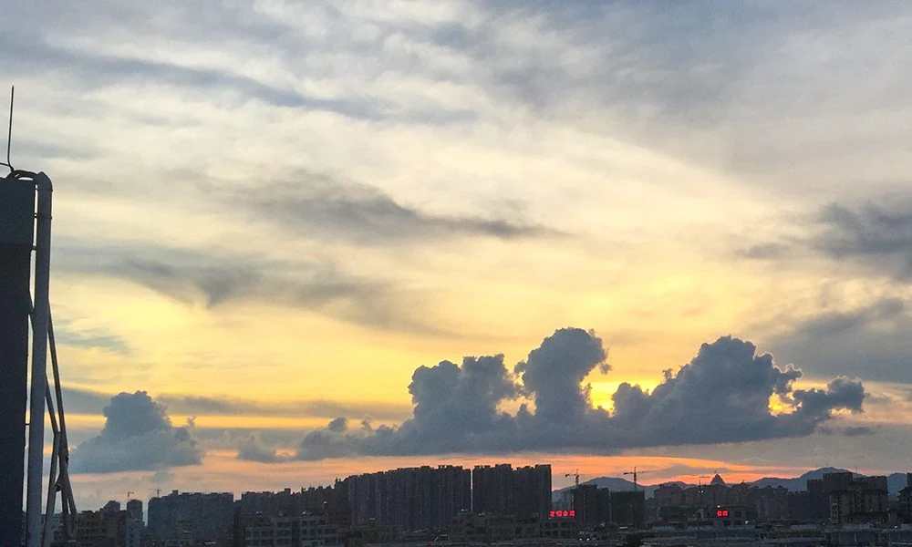
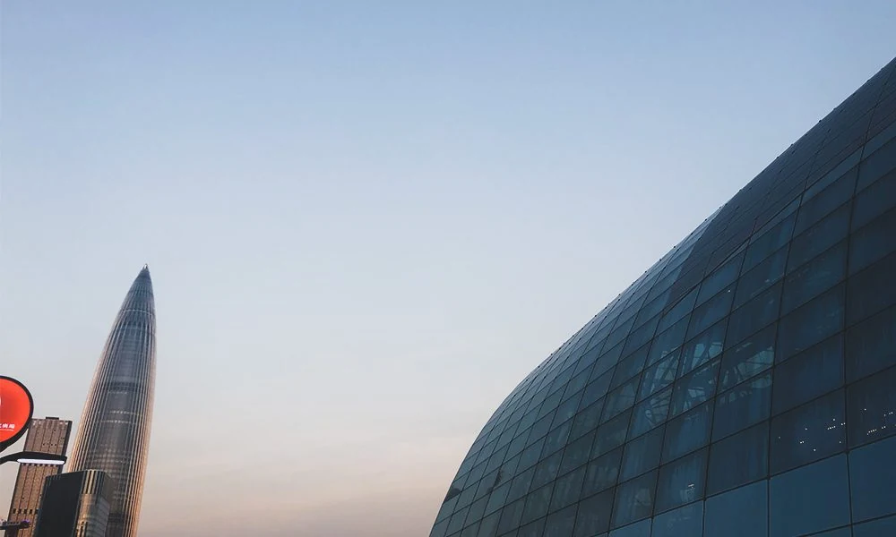
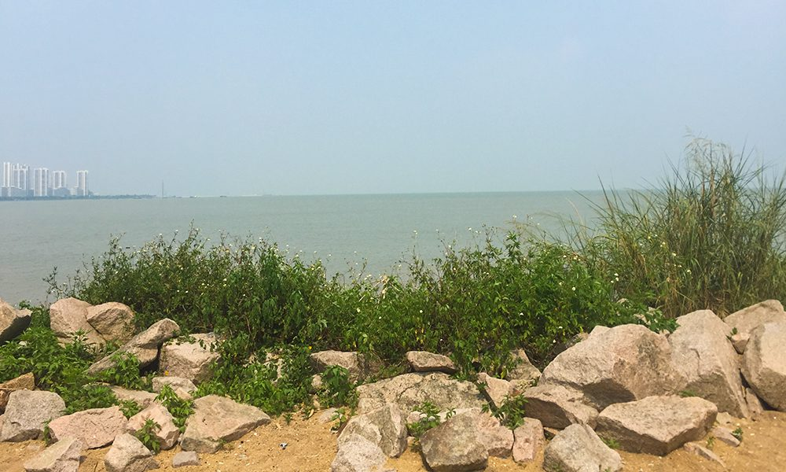
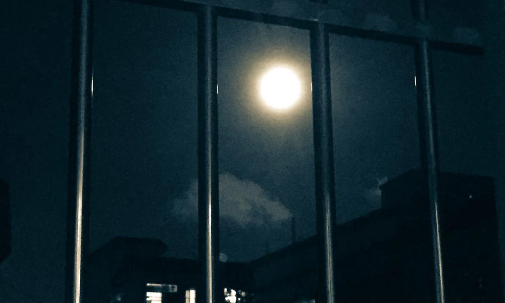
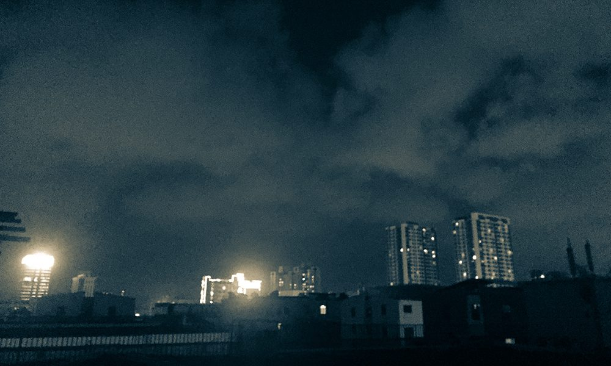
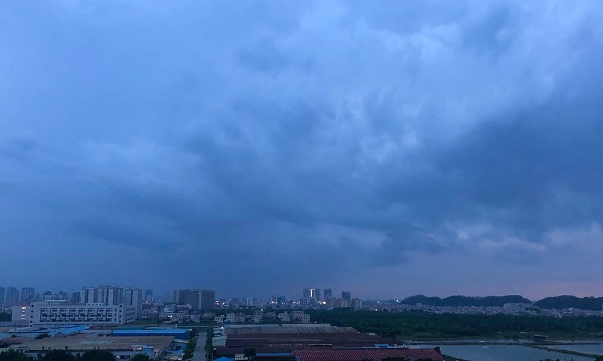

# Silence Is an Eternal Theme

Months on — looking back to the start — the instant it all felt certain — and just like that, the curtain fell

For months — I longed for the end from the very start — yet when it truly ended — words choked in my throat — tears streaming down

In a single day — I sweat out a whole month's worth

Under a 38°C blaze that felt like open flame — sweat pouring like rain — an unforgettable heat — that let me forget the ache of the parting to come

*The sunset that day*

*Morning*

Faraway places — society — the dyeing vat — setting out once more — every chapter deeply cherished — since it exists, it must carry its own meaning

Sprawled out lazily — swaying — gazing afar

A thin white line on the horizon — an inexplicable sorrow

Drifting alone through the night — quietly heartbroken — flying solitary

*Night*

*Clouds*

*Before dawn*

However reluctant to part — don't forget to pack your bags — meetings and partings — such is life

Hold tight to this moment

Young one

A steadfast creed

will surely bring us together again
