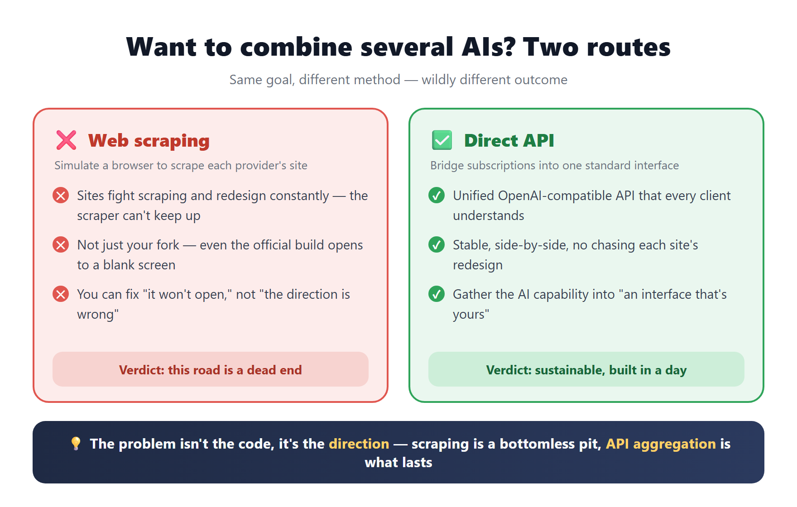
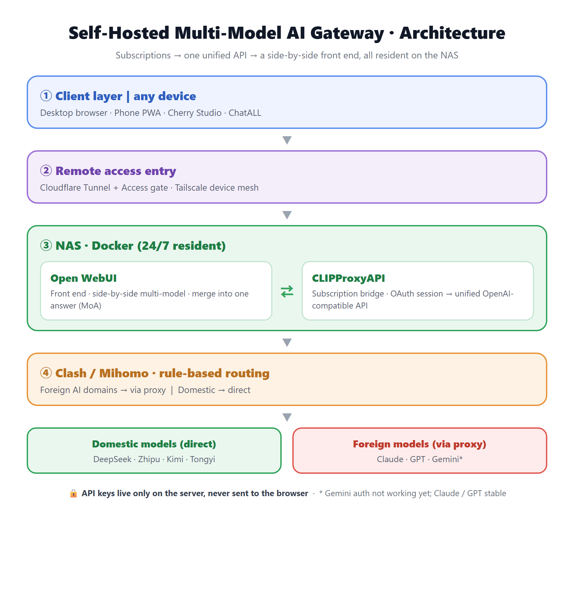
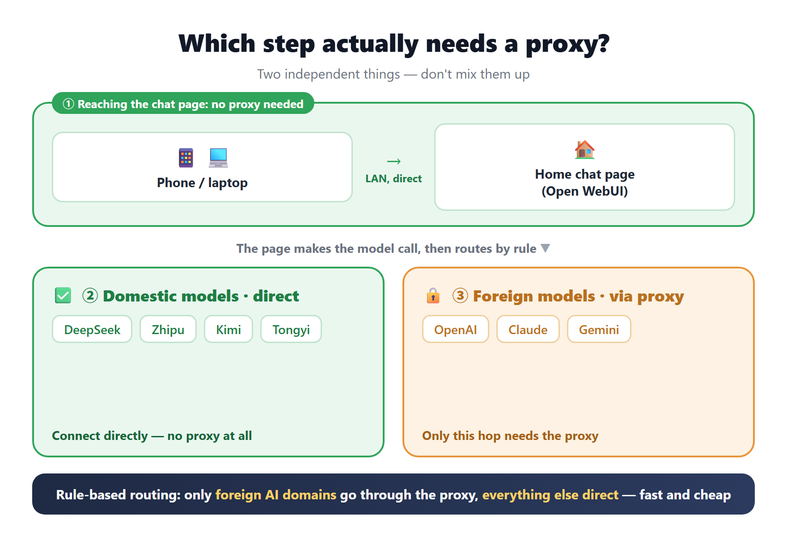

<!-- English is the default version. 中文原文见 index.zh.md（站内点「中文」按钮切换）。 -->

# Build Your Own Multi-Model AI Gateway in a Day: Turn Paid Subscriptions into a Family-Wide Hub

## Intro

For a long time I'd wanted one very simple thing:

**Type one question, and have Claude, GPT, and Gemini all answer it at once, side by side, so I can tell at a glance who did better.**

Sounds easy, right? But after trying every ready-made tool out there, not one felt right — they either charged money, wouldn't let me plug in my own key, or simply couldn't show answers side by side.

In the end I just built my own. This post is about how I went from "falling into a big pit" to "standing up a multi-model AI hub the whole family can use — in a single day."

---

## 1. First, I went down a dead end

At the start I set my sights on an open-source project called **ChatALL** — it claimed to let you "chat with all the AIs at once." I cloned it, planning to maintain my own fork.

It was nothing but pitfalls: the Windows build chain threw errors, the packaged app opened to a blank white screen… I stubbornly fixed every one of those bugs, and the app finally opened normally.

But right then I saw something more painful clearly:

**The way it "aggregates all the AIs" is by simulating a browser to scrape each provider's web page — and that road is basically dead today.**

The sites fight scraping aggressively and redesign constantly; the scraping logic simply can't keep up. It's not just this project — even the official build opens to a blank screen. What I fixed was only "it won't open"; what I couldn't fix was "the whole approach is wrong."

> One line for this part: **the problem isn't the code, it's the direction.** Web scraping is a bottomless pit.

So I set it down and switched to a completely different idea.

---

## 2. A different approach: don't scrape pages, bridge subscriptions

The new idea fits in one sentence:

**Stop scraping pages. Instead, unify your "subscriptions" into one standard API, then use a front end that can show answers side by side to call it.**

The whole architecture looks like this 👇

Top to bottom, just four layers:

- **Clients**: desktop browser, phone, any AI client — anything can connect.
- **Entry**: lets me reach it securely whether I'm home or out.
- **NAS**: the two services that do the real work run here, online 24/7.
- **Egress**: smart routing — what should go through a proxy does, what should connect directly does.

---

## 3. Three puzzle pieces

**Piece ①: the subscription bridge**

This is the soul of the whole thing.

I already pay for and use Claude, GPT, and the rest. There's an open-source tool that can "bridge" the **logged-in state of those subscriptions** into a single standard interface that every client understands (OpenAI-compatible).

In plain words: **the AIs I already pay for get gathered into one interface that's mine.**

**Piece ②: the front end (Open WebUI)**

An interface still has to be good to use. I picked the open-source **Open WebUI**, because it happens to meet all my requirements:

- ✅ Side-by-side multi-model — fire one question at several models
- ✅ Can **merge** several answers into one (the industry calls it Mixture-of-Agents)
- ✅ Can connect to **any** standards-compliant endpoint
- ✅ Data stays entirely in my hands, and it works in the phone browser too

**Piece ③: keeping it alive 24/7 (the NAS)**

If the first two pieces ran on my Mac, then the moment I close the lid and walk out the door, the whole family is cut off.

So I stuffed them into the **NAS** and run them with Docker — **independent of whether my computer is on, resident 24/7.**

---

## 4. The most confusing point: which step actually needs a proxy

I have to pull this one out on its own, because too many people get tangled up by it right away:

**These are two independent things — never mix them up:**

1. **The chat web page itself does not need a proxy.** It's just a page running on my home LAN; the phone reaches it over the local network.
2. **Only the hop that "goes abroad to call foreign models like OpenAI / Claude" needs the proxy.** Domestic models (DeepSeek, Zhipu, Kimi, Tongyi) **connect directly — no proxy at all.**

So the right approach is **rule-based routing**: only let the foreign AIs' domains go through the proxy, and connect everything else directly. Faster and cheaper.

---

## 5. Make it work for the whole family, and on the go: remote access

Working at home isn't enough — I want to open it anywhere, on my phone too. Two tools handle it:

- **Tailscale**: turns all my devices into one private network, so even when I'm out I can "get back" to the NAS at home.
- **Cloudflare Tunnel + Access**: gives it a fixed URL as a public entry, plus a gate — **only my own email is allowed in**, so no one else can even reach the page.

Even better: I **already had** these proxies and tunnels on my NAS (set up earlier for other services), so I just plugged in — almost zero extra cost.

---

## 6. A few real pitfalls (this is the good stuff)

The build wasn't all smooth. A few pitfalls worth noting:

- **The service mysteriously crashed in the middle of the night.** Digging in, it was a NAS system resource limit (the number of inotify instances) hitting its ceiling. I raised the limit and set it to run on boot, and it held up against the nightly restarts.
- **Some proxy nodes couldn't reach the AI endpoints.** I changed each node's "health check" address from the default test page **to OpenAI's real endpoint** — so dead nodes that can't reach the AI get auto-marked dead and auto-avoided.
- **The page was a bit slow to open the first time.** The front-end bundle is over a hundred MB and has to be downloaded across the border. The fix is simple: **"Add to Home Screen" to install it as an app (PWA)**, so the shell is cached locally and it opens near-instantly afterward.

---

## 7. Security: no one can steal my key

What many self-hosters worry about most is leaking the key. My approach:

**All API keys live only on the server side, and are never sent to the browser.**

Even if someone gets into my web page, they can only "use the models inside the site" — they **can't steal the key**. Add the email gate and login from before, and that's a double layer of insurance.

---

## 8. At the end of the day, what did I actually get

To wrap up. The essence of this thing is:

> Take **the AI capabilities I already pay for**, gather them into **one interface that belongs to me**, and let any device and any client in the family call multiple large models side by side — **built in a day, with almost no new monthly fees.**

And a bigger judgment I want to share:

**The road of "aggregating multiple AIs by scraping web pages" has reached its end** (I proved it firsthand with ChatALL). The truly sustainable direction is **API aggregation + a self-hosted front end**. Rather than chasing every site's redesign until you're worn out, gather the capabilities into your own interface.

Finally, two honest notes:

1. Bridging subscriptions into an API is, strictly speaking, a **gray area** (it may brush against each provider's terms of service). Internal personal use is fine, but don't abuse it, and definitely don't resell it.
2. Right now my setup has **Claude and GPT rock-solid, but Gemini's account authorization isn't working yet** — no spin: have is have, don't is don't.

---

*If you also want a "self-controlled, side-by-side multi-model" AI hub, this approach is yours to copy. For the specific tool names and pitfall details, let's talk in the comments.*
